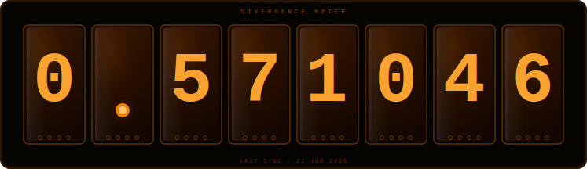

<!-- ════════════════════════════════════════════════════════════════════════
     FUTURE GADGET LABORATORY — MEMBER FILE
     CLASSIFICATION: OPEN  ·  WORLDLINE: β-0.571046%
     ════════════════════════════════════════════════════════════════════════ -->

<div align="center">


</div>

<br/>

<!-- ─── DIVERGENCE METER ───────────────────────────────────────────────────────
     Generated daily by GitHub Actions using a nixie-tube SVG renderer
     inspired by TriggersTools.SteinsGate
     Lib  → https://github.com/trigger-death/TriggersTools.SteinsGate
     Web  → https://trigger-testing.github.io/pwa-examples/divergence-meter/
     ─────────────────────────────────────────────────────────────────────── -->

<div align="center">



<br/><br/>

> *β Worldline — Reading Steiner: **ACTIVE***

</div>

<br/>

---

<!-- ─── QUOTE (auto-rotated on Oct 21 via GitHub Action) ─────────────────── -->
<!-- QUOTE_START -->
<div align="center">

> *❝ I've only lived **20 years**, but I don't want to change any of them.*
> *They're all part of my life — even the failures. ❞*
>
> <sub>— **Makise Kurisu** · Future Gadget Lab · Assistant Member</sub>

</div>
<!-- QUOTE_END -->

<br/>

---

<!-- ═══════════════════════════════════════════════════════════════════════════
     > whoami
     ═══════════════════════════════════════════════════════════════════════ -->

##  whoami"/>

<br/>

<table>
<tr>
<td width="52%" valign="top">

```
╔═══════════════════════════════════════════════╗
║  FUTURE GADGET LAB — ACCESS GRANTED           ║
║  MEMBER FILE  ·  CLASSIFICATION: OPEN         ║
╠═══════════════════════════════════════════════╣
║                                               ║
║  NAME     ▸  Ahmad                            ║
║  ALIAS    ▸  Ahmad-Skeptical                  ║   ║
║  ROLE     ▸  CS Student  ·  Lab Member #8     ║
║                                               ║
║  MISSION  ▸  Crack the algorithm of           ║
║              intelligence before the          ║
║              Organisation does                ║
║                                               ║
║  STATUS   ▸  Grinding across all worldlines   ║
║  GADGET   ▸  Phone Microwave (Name TBC)       ║
║                                               ║
╠═══════════════════════════════════════════════╣
║  DIVERGENCE READING  ·  β-0.571046%           ║
╚═══════════════════════════════════════════════╝
```

</td>
<td width="48%" valign="top">

```python
class LabMember:
    name   = "Ahmad"
    number = "#8"

    tracks = [
        "Competitive Programming",
        "AI Security / Adversarial ML",
        "Binary Exploitation",
        "Linear Algebra + Probability",
    ]

    stack = {
        "battle"  : "C++",
        "scripts" : "Python",
        "recon"   : "x64dbg · PE-Bear",
        "research": "PyTorch · Capstone",
    }

    worldline       = "β-0.571046%"
    reading_steiner = True

    def greet(self):
        return "El Psy Kongroo."
```

</td>
</tr>
</table>

<div align="center">


</div>

<br/>

---

<!-- ═══════════════════════════════════════════════════════════════════════════
     > ls future_gadgets/
     ═══════════════════════════════════════════════════════════════════════ -->

##  ls future_gadgets/"/>

> *Every experiment shifts the worldline. These are mine.*

<br/>

<table>
<tr>

<!-- ── Gadget #001 ─────────────────────────────────────────────────── -->
<td width="33%" valign="top">

```
╔════════════════════════════╗
║  FUTURE GADGET  #001       ║
║  RANKSEI — ランクセイ       ║
╠════════════════════════════╣
║                            ║
║  CP Analytics Dashboard    ║
║                            ║
║  ◈ CF / LC / AtCoder live  ║
║  ◈ Rating timelines        ║
║  ◈ Tag strength scoring    ║
║  ◈ H2H comparison mode     ║
║  ◈ Dark terminal aesthetic ║
║                            ║
║  Python · Streamlit        ║
║  Plotly · Pandas           ║
║                            ║
║  STATUS ▸  DEPLOYED  ✓     ║
╚════════════════════════════╝
```

[](https://ranksei.streamlit.app)
[](https://github.com/Ahmad-Rzx/RankSei-CP-Analytics-Dashboard)

</td>

<!-- ── Gadget #002 ─────────────────────────────────────────────────── -->
<td width="33%" valign="top">

```
╔════════════════════════════╗
║  FUTURE GADGET  #002       ║
║  KEIRO — 径路               ║
╠════════════════════════════╣
║                            ║
║  CP Execution              ║
║  Replay Engine             ║
║                            ║
║  ◈ Instrument C++ / Python ║
║  ◈ Record exec traces      ║
║  ◈ Replay as interactive   ║
║    visualizations          ║
║                            ║
║  C++ · Python              ║
║  FastAPI · React           ║
║                            ║
║  STATUS ▸  PHASE 1 DONE    ║
╚════════════════════════════╝
```

[](https://github.com/Ahmad-Rzx)

</td>

<!-- ── Gadget #003 ─────────────────────────────────────────────────── -->
<td width="33%" valign="top">

```
╔════════════════════════════╗
║  FUTURE GADGET  #003       ║
║  MALSIGHT                  ║
╠════════════════════════════╣
║                            ║
║  AI-Powered Static         ║
║  Malware Analyzer          ║
║                            ║
║  ◈ PE parsing + entropy    ║
║  ◈ XGBoost (EMBER 2018)    ║
║  ◈ Llama 3.2 via Ollama    ║
║  ◈ SSE streaming           ║
║  ◈ Fully local pipeline    ║
║                            ║
║  Python · FastAPI          ║
║  React · Capstone          ║
║                            ║
║  STATUS ▸  IN QUEUE        ║
╚════════════════════════════╝
```

[](https://github.com/Ahmad-Rzx)

</td>

</tr>
</table>

<br/>

---


---


<!-- ═══════════════════════════════════════════════════════════════════════════
     STATS
     ═══════════════════════════════════════════════════════════════════════ -->

## `> query --github-stats`

<div align="center">


&nbsp;


</div>

<br/>

---

<!-- ═══════════════════════════════════════════════════════════════════════════
     PHILOSOPHY
     ═══════════════════════════════════════════════════════════════════════ -->

## `> philosophy`

<div align="center">

```
╔══════════════════════════════════════════════════════════════════════════╗
║                                                                          ║
║   I read Kafka at 3 AM.  I debug at midnight.                            ║
║   I write poetry between proof-by-inductions.                            ║
║   Every failure is a D-Mail I can't send back —                          ║
║   so I carry it forward instead.                                         ║
║                                                                          ║
║   The universe bends toward the attractor field.                         ║
║   I bend toward the 1%.                                                  ║
║                                                                          ║
╠══════════════════════════════════════════════════════════════════════════╣
║                                                                          ║
║                        El Psy Kongroo.                                   ║
║                                                                          ║
╚══════════════════════════════════════════════════════════════════════════╝
```

</div>

<br/>

---

<!-- ─── LINKS ──────────────────────────────────────────────────────────────── -->

<div align="center">

[](https://codeforces.com/profile/Ahmad-Skeptical)
[](https://github.com/Ahmad-Rzx)
[](https://ranksei.streamlit.app)
[](https://tryhackme.com/p/ahmadm2clan)

<br/>

<sub>
Divergence meter powered by
<a href="https://github.com/trigger-death/TriggersTools.SteinsGate">TriggersTools.SteinsGate</a>
·
<a href="https://trigger-testing.github.io/pwa-examples/divergence-meter/">Web Tool</a>
·
Regenerated daily via GitHub Actions
</sub>

</div>

<br/>


